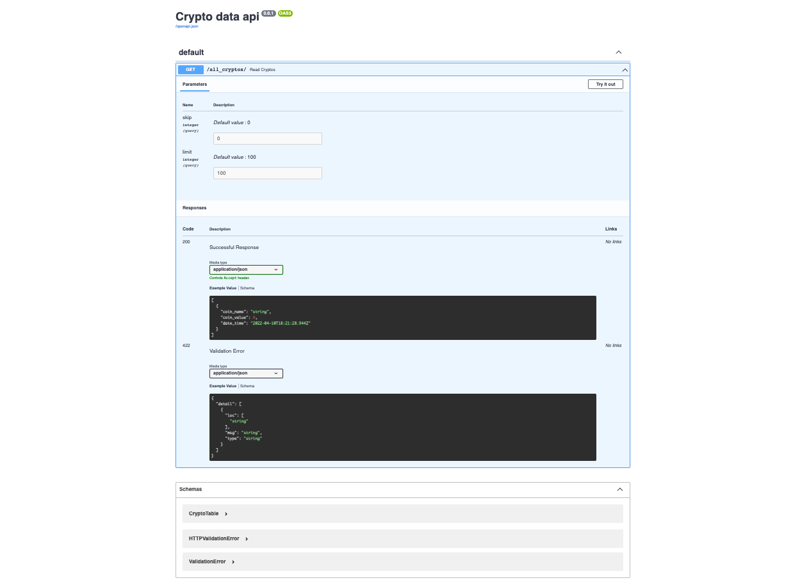
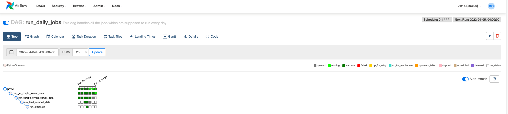

# crypto-data-api
This product scrapes the web for the value of crypto currencies then serves the data through an api. This is a project which I did for the purpose of showing my youtube community <a href='https://www.youtube.com/channel/UCzSlSeJ4XH4bWH79DKmIxjg'>here on dalicodes<a> how to use beautifulsoup, airflow and fastapi in building a data engineering system that fetches data from the web then serves the cleaner version of the data through an api. Here is the video tutorial on how I build this project <a href='https://www.youtube.com/channel/UCzSlSeJ4XH4bWH79DKmIxjg'>here<a>.

# Installation
1. clone or fork the repo and cd into the main repo.
2. switch the local version of python to 3.10.0 using `pyenv local 3.10.0`.
3. create the virtual environment using `python -m venv venv`.
4. activate the virtual environment using `source venv/bin/activate` for the case of mac.
5. install all the requirements of the project using `pip install -r requirements.txt`.

## creating airflow user

# Execution
## Starting airflow

1. open a terminal and cd to the root folder of the project.
2. activate the virtual environment using `source venv/bin/activate`
3. run `export AIRFLOW_HOME=`\`pwd``/airflow`
4. run `airflow webserver --port 8080`
5. open a new terminal in the root directory of the project and activate the virtual environment using step 2
6. run `export OBJC_DISABLE_INITIALIZE_FORK_SAFETY=YES`
7. run `export AIRFLOW_HOME=`\`pwd``/airflow`
8. run `airflow scheduler`
9. you can access airflow on your web browser on `http://localhost:8080`

## Starting fastapi

1. open a new terminal
2. cd into the root directory of the project and activate the virtual environment using `source venv/bin/activate`
3. cd into the api folder and run `uvicorn main:app --reload`
2. you can access the api on your web browser on `http://127.0.0.1:8000/docs`
